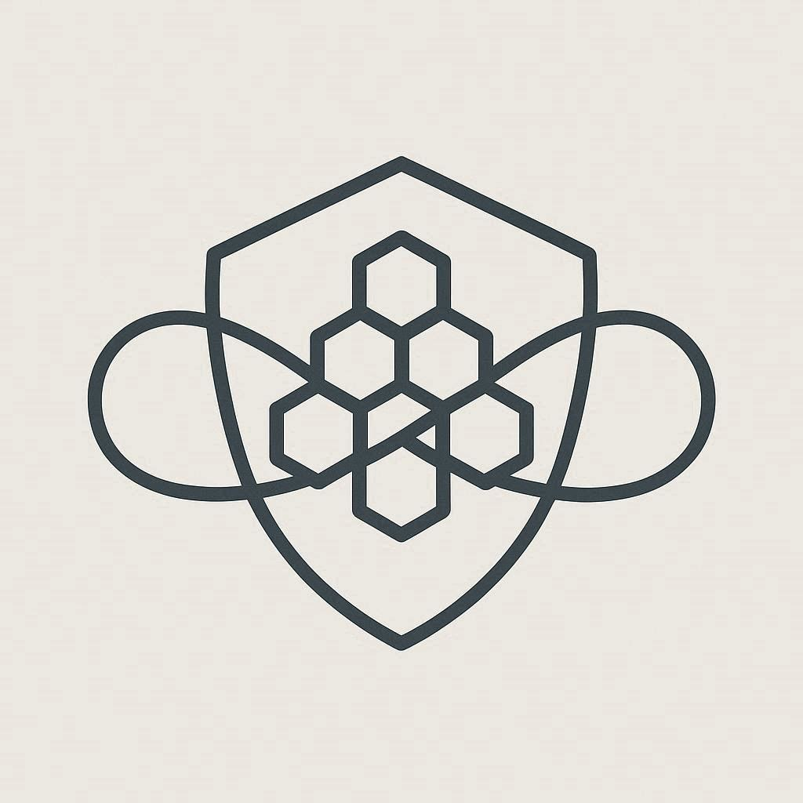
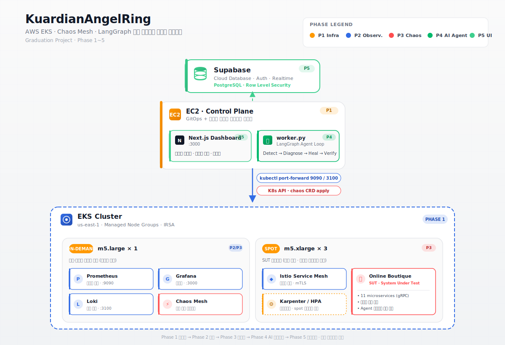
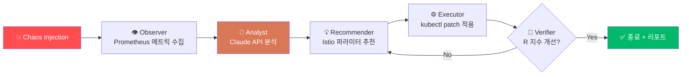

<div align="center">



# 🛡️ KuardianAngelRing

### *AI-Powered Self-Healing Pipeline for Kubernetes Chaos*

**카오스 주입 → AI 분석 → Istio 파라미터 자동 튜닝 → 회복 검증**, 끝까지 사람 손 안 닿는 자가복구 파이프라인

[](https://www.terraform.io/)
[](https://aws.amazon.com/eks/)
[](https://istio.io/)
[](https://chaos-mesh.org/)
[](https://langchain-ai.github.io/langgraph/)
[](https://www.anthropic.com/)
[](./LICENSE)

[**🚀 Quick Start**](#-quick-start) ·
[**🏗️ Architecture**](#%EF%B8%8F-architecture) ·
[**🤖 AI Loop**](#-ai-loop) ·
[**🐛 Troubleshooting**](#-troubleshooting) ·
[**🗺️ Roadmap**](#%EF%B8%8F-roadmap)

</div>

---

## ✨ Features

- 🚀 **One-command 인프라** — `./scripts/up.sh` 한 줄로 EKS + Istio + 모니터링 + Chaos Mesh + SUT 자동 구축
- 🛡️ **수호천사 AI 루프** — Claude API + LangGraph 멀티에이전트가 장애 분석 → 추천 → 적용 → 검증 자동화
- 📊 **R 지수 (Resilience Index)** — 가용성·레이턴시·복구속도 가중평균 단일 지표로 회복탄력성 정량화
- 🔬 **Chaos as Code** — Pod Kill / Network Delay / CPU Stress 등 실험 매니페스트로 버전 관리
- 📈 **실시간 가시화** — Next.js 14 + Supabase Realtime으로 AI 루프 단계별 진행 상황 실시간 스트리밍
- 💰 **$0 정리** — `./scripts/down.sh` 한 줄로 모든 AWS 리소스 클린업, NAT/EKS 등 시간당 과금 자원 0원
- 🧪 **GitOps 배포** — ArgoCD로 sample-app 선언적 관리, 카오스 환경에서도 desired state 유지
- 📝 **검증된 트러블슈팅** — Phase 1 구축 중 만난 6가지 인프라 이슈 분석 문서화

---

## 🏗️ Architecture

<div align="center">

</div>

```
                        Supabase (Cloud DB / Realtime)
                                  ▲
                                  │ INSERT agent_iterations
                                  │
                ┌─────────────────┴─────────────────┐
                │       EC2 (t3.medium / Public)     │
                │  ┌──────────────┐  ┌────────────┐  │
                │  │ Next.js :3000│  │ worker.py  │  │
                │  │ (Dashboard)  │  │ AI Loop    │  │
                │  └──────────────┘  └────────────┘  │
                └─────────────┬─────────────────────┘
                              │
                              │ kubectl / port-forward (9090, 3100)
                              ▼
        ┌─────────────────────────────────────────────────────┐
        │                EKS Cluster (chaos-eks)              │
        │                                                     │
        │   ┌─────────────────┐      ┌─────────────────────┐  │
        │   │  System Node    │      │   Workload Nodes    │  │
        │   │  (On-demand × 1)│      │   (Spot × 2~3)      │  │
        │   │                 │      │                     │  │
        │   │  📊 Prometheus  │      │  🔀 Istio mesh      │  │
        │   │  📊 Grafana     │      │  🛒 Online Boutique │  │
        │   │  📊 Loki        │      │  🚀 ArgoCD Apps     │  │
        │   │  💥 Chaos Mesh  │      │  ⚙️  sample-app     │  │
        │   └─────────────────┘      └─────────────────────┘  │
        │                                                     │
        │              EBS CSI Driver · IRSA · OIDC           │
        └─────────────────────────────────────────────────────┘
```

> EC2가 EKS **밖**에 있는 이유: `terraform destroy`로 EC2 자기 자신을 삭제하는 문제 방지 + `$0` 정리 보장

---

## 🤖 AI Loop

Online Boutique(SUT)에 카오스가 주입되면, **5명의 AI 에이전트**가 협력해 회복탄력성을 자동으로 끌어올립니다.

<div align="center">



</div>

| 단계 | 에이전트 | 역할 |
|:---:|---|---|
| 1 | 👁️ **Observer** | Prometheus에서 에러율 · p99 레이턴시 · MTTR 수집 |
| 2 | 🧠 **Analyst** | Claude API 호출 — 장애 원인 / 병목 / 가설 도출 |
| 3 | 💡 **Recommender** | Istio `timeout` / `retry` / `circuitBreaker` 파라미터 제안 (범위 검증) |
| 4 | ⚙️ **Executor** | `kubectl patch`로 VirtualService · DestinationRule 즉시 적용 |
| 5 | 🎯 **Verifier** | R 지수 재측정 → 개선 시 종료, 아니면 ④ 재반복 (max 5 iter) |

### 📐 R 지수 (Resilience Index)

```
R = 0.4 × Availability + 0.3 × LatencyScore + 0.3 × RecoverySpeed
```

| 가중치 | 메트릭 | 정의 |
|:---:|---|---|
| **0.4** | Availability | `1 - (5xx 응답 / 전체 응답)` |
| **0.3** | LatencyScore | `min(1, p99_baseline / p99_current)` |
| **0.3** | RecoverySpeed | `1 - clip(MTTR / 60s, 0, 1)` |

루프 종료 시 **Before / After 비교 리포트** 자동 생성 → Supabase에 저장 → Next.js 대시보드 시각화.

---

## 🛠️ Tech Stack

<div align="center">

| Layer | Technology |
|---|---|
| **☁️ Cloud** | AWS (EKS, EC2, VPC, NAT, KMS, EBS, IAM) |
| **🏗️ IaC** | Terraform 1.6+, terraform-aws-modules/eks v20 |
| **☸️ Orchestration** | Kubernetes 1.31, Helm 3.x |
| **🔀 Service Mesh** | Istio 1.29 (sidecar mode) |
| **💥 Chaos** | Chaos Mesh 2.8 |
| **📊 Observability** | Prometheus, Grafana, Loki, Promtail |
| **🤖 AI** | Anthropic Claude (Sonnet 4.6), LangGraph |
| **💾 Realtime DB** | Supabase (Postgres + Realtime) |
| **🎨 Dashboard** | Next.js 14 (App Router, FSD 2.1+), TypeScript |
| **🚀 GitOps** | ArgoCD |
| **🛒 SUT** | Google Cloud Online Boutique (11 microservices) |

</div>

---

## 📁 Repository Structure

```
KuardianAngelRing/
├── 📦 terraform/
│   ├── 1-base/              # VPC + EKS + EC2 + IRSA
│   └── 2-platform/          # Istio + 모니터링 + Chaos Mesh + Boutique
├── 🤖 worker/               # LangGraph AI 루프 (Python)
├── 🎨 ../iac-nextjs/        # Next.js 14 대시보드 (별도 레포)
├── 🚀 argocd/               # GitOps Application 매니페스트
├── 💥 chaos-experiments/    # 카오스 시나리오 모음 (CRD YAML)
├── 📜 scripts/
│   ├── up.sh               # 전체 자동 구축
│   └── down.sh             # 전체 정리 ($0)
└── 📚 docs/
    └── issues/             # 트러블슈팅 가이드
```

---

## 🚀 Quick Start

> **목표**: git clone 직후부터 EKS + Online Boutique + Chaos Mesh 환경을 띄우고 첫 카오스 실험까지.
> **소요 시간**: 약 22~28분.

### 1️⃣ 로컬 도구 설치

```bash
# macOS (Homebrew)
brew install terraform awscli kubectl helm

# 버전 확인
terraform -version    # >= 1.6
aws --version
kubectl version --client
helm version
```

### 2️⃣ AWS 자격증명

```bash
aws configure
# Region: ap-northeast-2
aws sts get-caller-identity   # 자격증명 검증
```

> 💡 IAM 사용자에 EKS / EC2 / VPC / IAM / EBS / KMS 관리 권한 필요. 학습 환경이면 `AdministratorAccess` 간편.

### 3️⃣ EC2 Key Pair 생성

AWS 콘솔 → EC2 → Key Pairs → **Create key pair** → 이름 `chaos-eks-key`, 포맷 `.pem` → 다운로드.

```bash
mv ~/Downloads/chaos-eks-key.pem ~/.ssh/
chmod 400 ~/.ssh/chaos-eks-key.pem
```

### 4️⃣ Spot vCPU 쿼터 확인 *(선택)*

`m5.xlarge × 2 = 8 vCPU` 사용. 신규 계정은 보통 5 vCPU 한도라 부족할 수 있음.

```bash
aws service-quotas get-service-quota \
  --service-code ec2 --quota-code L-34B43A08 \
  --region ap-northeast-2 --query 'Quota.Value'
```

> 8 미만이면 콘솔 → Service Quotas → *"All Standard Spot Instance Requests"* 에서 증설 신청.

### 5️⃣ `terraform.tfvars` 작성

```bash
cd terraform/1-base
```

`terraform/1-base/terraform.tfvars`:
```hcl
aws_region   = "ap-northeast-2"
key_name     = "chaos-eks-key"
iac_aws_repo = "https://github.com/<your-org>/Iac-aws"
my_ip_cidr   = "0.0.0.0/0"   # 본인 IP/32 권장 (보안)
```

### 6️⃣ 구축 실행

```bash
cd ../..
./scripts/up.sh
```

| 단계 | 작업 | 소요 |
|:---:|---|:---:|
| **[1/5]** | `terraform apply 1-base` — VPC + EKS + EC2 + 노드그룹 | ~14분 |
| **[2/5]** | 로컬 kubeconfig 설정 | 즉시 |
| **[3/5]** | EC2 user_data — kubectl/helm/git 설치 | ~2분 |
| **[4/5]** | `terraform apply 2-platform` — Istio + 모니터링 + Chaos + SUT | ~6~8분 |
| **[5/5]** | port-forward (Prometheus 9090, Loki 3100) | ~1분 |

### 7️⃣ 접속 / 검증

> 모든 kubectl 명령은 **로컬 머신에서 직접** 실행 (`up.sh`가 kubeconfig 자동 설정)

#### 🛒 Online Boutique
```bash
kubectl get svc frontend-external -n online-boutique
# EXTERNAL-IP의 ELB 주소를 브라우저에 입력
```

#### ⚙️ Chaos Mesh Dashboard
```bash
kubectl port-forward svc/chaos-dashboard -n chaos-mesh 2333:2333
# → http://localhost:2333
```

#### 📊 Grafana
```bash
kubectl port-forward svc/kube-prometheus-stack-grafana -n monitoring 3000:80
# → http://localhost:3000

# 비밀번호 조회
kubectl get secret kube-prometheus-stack-grafana -n monitoring \
  -o jsonpath='{.data.admin-password}' | base64 -d
```

#### 🎨 AI Dashboard *(Phase 2 완료 후)*
```bash
# Next.js 대시보드 (EC2에서 실행)
ssh -i ~/.ssh/chaos-eks-key.pem -L 3001:localhost:3000 ec2-user@<EC2_IP>
# → http://localhost:3001
```

### 8️⃣ 정리 (비용 $0)

```bash
./scripts/down.sh   # yes 입력
```

→ 약 10~15분 후 모든 AWS 리소스 삭제. **Supabase 외 시간당 과금 0원.**

---

## 🎬 Demo

### 🛒 카오스 시연 흐름 (5분)

| | |
|---|---|
| **1.** Online Boutique 접속 | 정상 작동 확인 |
| **2.** Chaos Dashboard에서 `cartservice` Pod Kill 실험 생성 | `app=cartservice`, mode `one`, duration `30s` |
| **3.** 부띠끄 새로고침 | 카트 페이지 503 잠깐 → 자동 복구 |
| **4.** AI Dashboard 관측 | Observer → Analyst → ... → Verifier 사이클 실시간 진행 |
| **5.** Grafana 그래프 | 메트릭 spike → 새 파드 ramp-up → R 지수 개선 |

> 자세한 가이드: [`docs/demo-flow.md`](./docs/demo-flow.md)

---

## 🐛 Troubleshooting

Phase 1 구축 중 자주 만나는 6가지 이슈와 해결책을 별도 문서로 정리했습니다.

| # | 이슈 | 심각도 |
|:---:|---|:---:|
| 01 | EC2 user_data 타임아웃 — `npm install ENOENT` | P1 |
| 02 | Loki CrashLoopBackOff — read-only filesystem | P1 |
| 03 | EBS CSI Driver 부재 — PVC binding 안 됨 | P1 |
| 04 | Istio sidecar webhook 차단 — Node SG port 15017 | **P0** |
| 05 | Namespace `Terminating` 무한 stuck — Chaos Mesh CRD finalizer | P2 |
| 06 | `.terraform` cache 중복 파일 — `* 2.tf` (macOS sync) | P1 |

전체 보기: [`docs/issues/`](./docs/issues/)

---

## 🗺️ Roadmap

- [x] **Phase 1** — EKS 인프라 + Chaos Mesh + 모니터링 자동 구축
- [x] **Phase 2** — Next.js 14 + Supabase Realtime 대시보드
- [x] **Phase 3** — LangGraph AI 루프 + R 지수 자동 개선
- [x] **Phase 4** — ArgoCD GitOps + sample-app 선언적 관리
- [x] **Phase 5** — End-to-end 시연 + Before/After 리포트 자동화

> 다음 마일스톤: 멀티 클러스터 페일오버 시나리오 / OpenAI/Gemini 멀티 LLM 비교 실험 *(아이디어 단계)*

---

## 📝 Commit Convention

| 이모지 | 용도 |
|:---:|---|
| ✨ | 새 기능 |
| 🐛 | 버그 수정 |
| ♻️ | 리팩토링 |
| 🔧 | 설정 변경 (Terraform, Helm values 등) |
| 📝 | 문서 |
| 🚀 | 배포 / 인프라 |
| 🔥 | 코드·파일 삭제 |

---

## 🤝 Contributing

이 프로젝트는 졸업과제로 시작했지만, 카오스 엔지니어링 + AI 자가복구에 관심 있는 분들의 기여를 환영합니다.

1. Fork & branch (`git checkout -b feature/amazing`)
2. Commit (`✨ Add amazing feature`)
3. Push & open Pull Request

---

## 📄 License

[MIT](./LICENSE) © 2026 KuardianAngelRing

<div align="center">

**🛡️ Built with chaos in mind, powered by AI to heal.**

[⬆ Back to top](#%EF%B8%8F-kuardianangelring)

</div>
